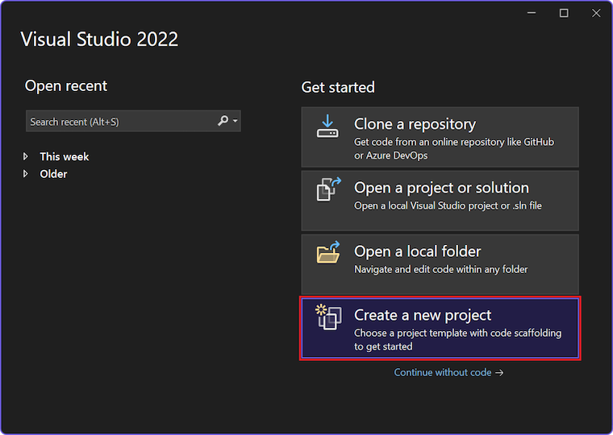
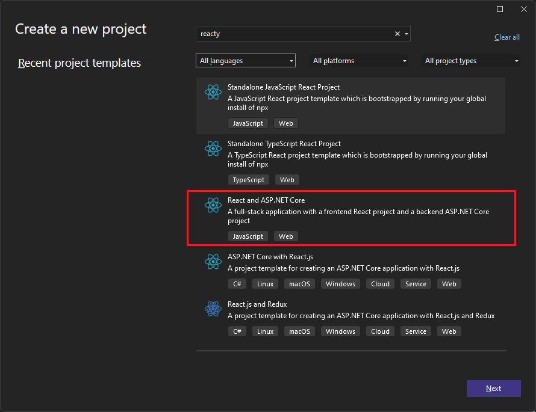
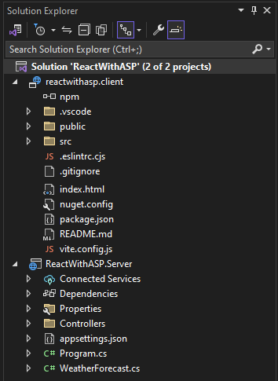
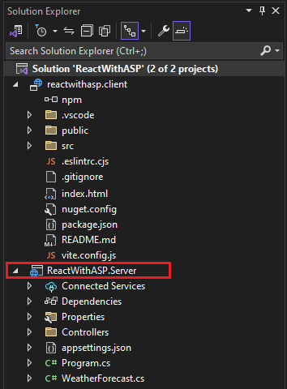
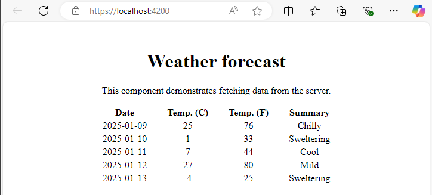

## ⚛️ ASP.NET Core + React Uygulaması Oluşturma (Visual Studio 2022)

> 💡 **Amaç:**
>
> ASP.NET Core’u **API backend** olarak, React’i ise **frontend UI** olarak kullanarak modern bir tam yığın (full-stack) web uygulaması geliştirmek.

---

## 🧰 Gerekli Ön Koşullar

1. **Visual Studio 2022 (v17.11 veya üzeri)**

   Yüklü değilse [Visual Studio Downloads](https://visualstudio.microsoft.com/downloads/) adresinden indir.

   * **ASP.NET and web development** iş yükünü (workload) kurmayı unutma.

   > 🧭 Mevcut kurulum varsa:
   >
   > `Tools > Get Tools and Features... > Modify` > "ASP.NET and web development" seç.
   >
2. **Node.js ve npm**

   [https://nodejs.org](https://nodejs.org/) adresinden indir.

   npm, React projesinin CLI araçlarını yönetmek için gereklidir.

---

## 🧩 Adım 1 — Yeni Proje Oluştur

1. **Visual Studio** ’yu aç.

   
2. “Create a new project” seçeneğini tıkla.

   
3. Arama kutusuna **React** yaz → **React and ASP.NET Core** şablonunu seç.
4. Proje adı olarak örneğin `ReactWithASP` yaz ve **Next** de.

   
7. **Configure for HTTPS** seçeneğini işaretli tut.

   Diğer ayarları varsayılan bırak.
8. **Create** butonuna bas.


---

## 🗂️ Adım 2 — Proje Yapısı

Visual Studio proje oluşturduğunda, aşağıdaki gibi bir çözüm (solution) yapısı oluşturur:

```
ReactWithASP.sln
 ├── ReactWithASP.Server   (ASP.NET Core API projesi)
 └── reactwithasp.client   (React UI projesi - Vite tabanlı)
```

### Yeni veya Değişen Dosyalar:

* **vite.config.js** → React yapılandırması
* **App.jsx** → API verilerini çeker (örneğin hava durumu örneği)



---

## ⚙️ Adım 3 — Proje Özelliklerini Ayarla

1. `ReactWithASP.Server` projesine sağ tıkla → **Properties** → **Debug** sekmesi.
2. “Open debug launch profiles UI” seçeneğine gir.
3. **Launch Browser** seçeneğini *kapat* (`https` profili için).
   > Bu, tarayıcının otomatik olarak açılmasını engeller.
   >
4. Çözüm (Solution) adına sağ tıkla → **Properties**
   * **Startup Project** ayarını **Multiple projects** yap.
   * Her iki projeyi de “Start” olarak ayarla.

---

## ▶️ Adım 4 — Uygulamayı Çalıştır

1. **F5** tuşuna bas veya **Start** düğmesine tıkla.

   Visual Studio iki terminal açacaktır:

   * 🧱 **ASP.NET Core (API) terminali**
   * ⚡ **Vite CLI (React)** terminali

     Mesaj: `VITE v4.4.9 ready in 780 ms` gibi görünebilir.
2. Tarayıcıda uygulama otomatik açılır.

   React arayüzü, ASP.NET Core API’den veri çeker (örnek: “WeatherForecast”).



---

## 🧪 Adım 5 — Yayınlama (Publish)

1. `ReactWithASP.Server` projesine sağ tıkla →

   **Add > Project Reference** →

   `reactwithasp.client` projesini seç ve **OK** de.
2. Ardından `.csproj` dosyasını düzenle:

   Aşağıdaki satırı ekle veya doğrula 👇

   ```xml
   <ProjectReference Include="..\reactwithasp.client\reactwithasp.client.esproj">
       <ReferenceOutputAssembly>false</ReferenceOutputAssembly>
   </ProjectReference>
   ```
3. Gerekirse projeyi **Reload Project** ile yeniden yükle.
4. `Program.cs` içinde aşağıdaki satırların olduğundan emin ol:

   ```csharp
   app.UseDefaultFiles();
   app.UseStaticFiles();

   if (app.Environment.IsDevelopment())
   {
       app.UseSwagger();
       app.UseSwaggerUI();
   }
   ```
5. Son olarak:

   * Sağ tıkla → **Publish**
   * Hedef seç:  **Azure** ,  **Folder** ,  **IIS** , vb.

> ⚙️ Yayın sırasında `npm run build` komutu otomatik çalışır.
>
> Bu nedenle normal ASP.NET Core projelerine göre biraz daha uzun sürebilir.

---

## 🧩 Adım 6 — Yayın Dosyaları

Klasöre yayınlarsan, React tarafından üretilen statik dosyalar (`/build` altındakiler)

ASP.NET Core’un `wwwroot` klasörüne dahil edilir.

Detaylar için bkz: [ASP.NET Core directory structure](https://learn.microsoft.com/aspnet/core/fundamentals/).

---

## 🧯 Sık Karşılaşılan Sorunlar (Troubleshooting)

### ⚠️ Proxy Error

```
[HPM] Error occurred while trying to proxy request /weatherforecast ...
```

**Çözüm:**

React (frontend) backend’ten önce başlatılmış olabilir.

ASP.NET Core API terminali aktif olduktan sonra sayfayı yenile.

Ayrıca:

* Solution > Properties > Startup Projects → Backend projesinin *ilk sırada* olduğundan emin ol.

---

### ⚙️ Port Uyuşmazlığı

`launchSettings.json` içindeki `applicationUrl` (örnek: `https://localhost:7183`)

ve `vite.config.js` dosyasındaki `target` ayarının aynı olduğundan emin ol.

```javascript
target: 'https://localhost:7183/'
```

---

### 🔒 Sertifika Hatası

```
Your connection isn't private
```

**Çözüm:**

`%appdata%\local\asp.net\https` veya

`%appdata%\roaming\asp.net\https` klasörlerindeki React sertifikalarını sil → yeniden dene.

---

### 🐳 Docker Kullanıyorsan

Visual Studio’da Containers penceresinden **HTTPS portunu** kontrol et.

Docker içindeki `Ports` veya `Environment` sekmesi bu bilgiyi gösterir.

---

## ✅ Sonuç

Bu yapı ile:

* **ASP.NET Core** → API servisleri sunar
* **React (Vite)** → kullanıcı arayüzünü oluşturur
* İkisi Visual Studio içinde **tek bir çözüm (solution)** olarak birlikte çalışır.

---
